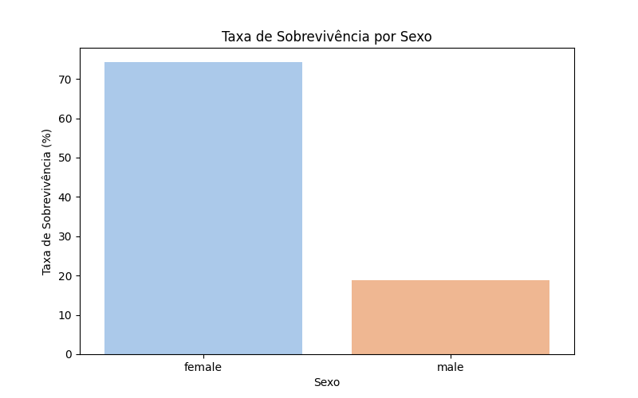

# Análise Exploratória - Titanic
Esse projeto/análise foi desenvolvida para o curso de Introdução ao Data Science do SCTEC e Senai. O objetivo principal é de realizar uma EDA (Análise Exploratória de Dados) utilizando o dataset fornecido no PDF de atividade prática do curso. Aqui a proposta é de compreender quais fatores influenciaram e nortearam a sobrevivência dos passageiros, realizando um tratamento dos dados desde o conhecimento dos dados do dataset, ajuste de tipagem, agrupamentos (GroupBy) e visualizações gráficas para melhor entendimento dos dados.

A ideia com o EDA é identificar padrões correlacionados entre o sexo, classe social, idade, valor pago pela passagem, porto de embarque e outros, permitindo compreender a relação entre variáveis socioeconômicas e a sobrevivência dos embarcados.

## O que foi realizado no projeto
Foi realizada a análise exploratória de dados (EDA) no dataset Titanic, incluindo:
- Tratamento de dados;
- Criação de variáveis;
- Análises estatísticas;
- Visualizações gráficas das análises estatísticas.

---

## Importação e Compreensão dos Dados
Inicialmente, utilizando a biblioteca Pandas, os dados foram carregados para visualização, e para começar a entender o formato e como os dados estavam distribuídos, foram aplicados os seguintes:

- `head()` -> Para visualização inicial das primeiras linhas;
- `info()` -> Para análise de tipagem e valores nulos de todos os dados;
- `describe()` -> Para ter um resumo estatístico e entender rapidamente como os dados se comportam.

Com isso, consegui identificar a estrutura geral do dataset e também, colunas com dados ausentes, para que fossem tratados.

---

## Tratamento e Preparação dos Dados
Anterior ao tratamento e preparação dos dados, eu realizei a etapa de identificar questões estruturais que apresentassem dados inconsistentes que pudessem afetar a análise dos dados do dataset, tais como os encontrados:

- Alto volume de valores nulos na coluna `Cabin`;
- Valores ausentes nas colunas `Age` e `Embarked`;
- Necessidade de melhor organização e categorização de variáveis numéricas para análises comparativas, como a coluna `age` com dados muito dispersos;
- Tipagem inadequada de algumas variáveis categóricas, como `Pclass`, `Sex`, `Embarked`.

A partir desse diagnóstico, foram aplicadas as seguintes etapas de tratamento e preparação dos dados:

- Criação da variável **Tem_cabine**, indicando se o passageiro possuía registro de cabine;
- Remoção da coluna original `Cabin`, devido ao elevado percentual de valores ausentes;
- Preenchimento da coluna `Embarked` com a moda e porcentagem;
- Preenchimento da coluna `Age` com a mediana por classe (`Pclass`), reduzindo viés entre classes sociais;
- Criação da variável categórica **Faixa_Etaria** para permitir análises por grupos etários;
- Criação de quartis da variável `Fare` utilizando `pd.qcut`, possibilitando análise por faixas de preço;
- Ajuste de tipagem das colunas categóricas (`Pclass`, `Sex`, `Embarked`).

Após a aplicação dos tratamentos, foi realizada nova verificação de valores nulos para validar a consistência e as alterações/correções feitas.

---

## Análises Realizadas

### Sobrevivência por Sexo

  

Observa-se que mulheres apresentaram taxa de sobrevivência significativamente superior aos homens, deixando claro o famoso discurso conhecido e evidenciado de "women and children first", conduta priorizada para garantir a segurança dos mais vulneráveis primeiro.

## Tecnologias
- Python;
- Pandas;
- NumPy;
- Matplotlib;
- Seaborn.