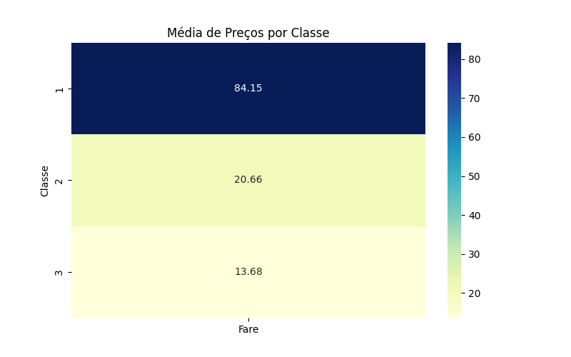
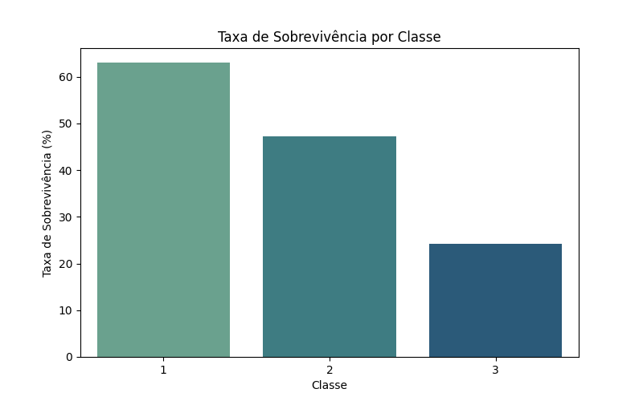
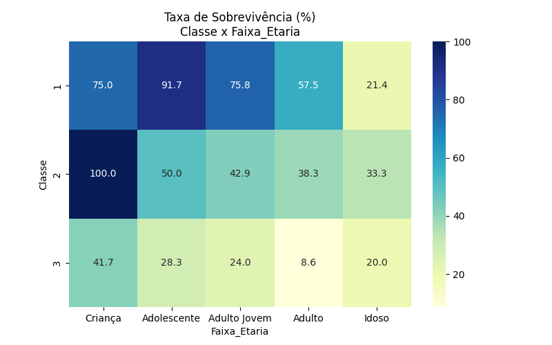
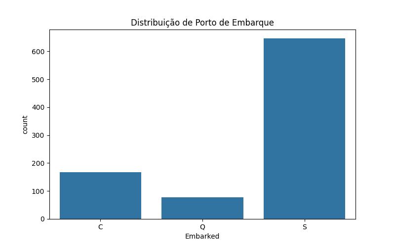
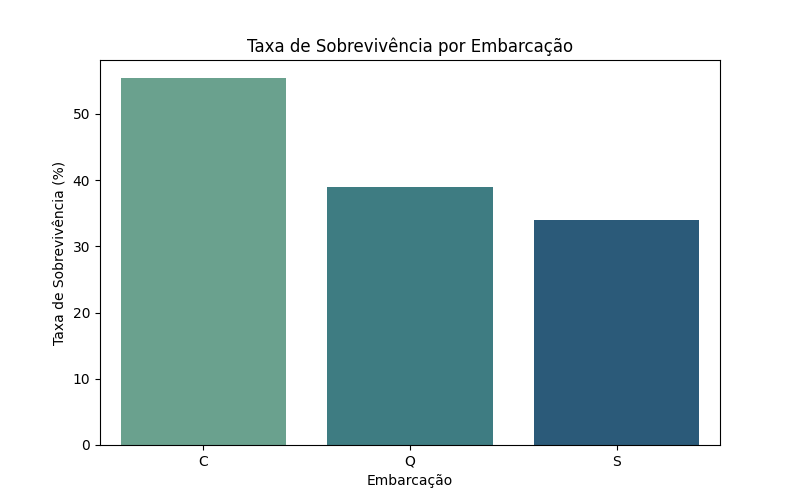
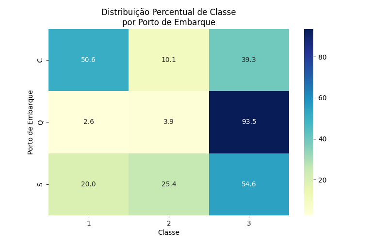

# Análise Exploratória - Titanic
Esse projeto/análise foi desenvolvida para o curso de Introdução ao Data Science do SCTEC e Senai. O objetivo principal é de realizar uma EDA (Análise Exploratória de Dados) utilizando o dataset fornecido no PDF de atividade prática do curso. Aqui a proposta é de compreender quais fatores influenciaram e nortearam a sobrevivência dos passageiros, realizando um tratamento dos dados desde o conhecimento dos dados do dataset, ajuste de tipagem, agrupamentos (GroupBy) e visualizações gráficas para melhor entendimento dos dados.

A ideia com o EDA é identificar padrões correlacionados entre o sexo, classe social, idade, valor pago pela passagem, porto de embarque e outros, permitindo compreender a relação entre variáveis socioeconômicas e a sobrevivência dos embarcados.

---

## O que foi realizado no projeto
Foi realizada a análise exploratória de dados ("EDA) no dataset Titanic, incluindo:
- Tratamento de dados;
- Criação de variáveis;
- Análises estatísticas;
- Visualizações gráficas das análises estatísticas.

---

## Importação e Compreensão dos Dados
Inicialmente, utilizando a biblioteca Pandas, os dados foram carregados para visualização, e para começar a entender o formato e como os dados estavam distribuídos, foram aplicados os seguintes:

- `head()` -> Para visualização inicial das primeiras linhas;
- `info()` -> Para análise de tipagem e valores nulos de todos os dados;
- `describe()` -> Para ter um resumo estatístico e entender rapidamente como os dados se comportam.

Com isso, consegui identificar a estrutura geral do dataset e também, colunas com dados ausentes, para que fossem tratados.

---

## Tratamento e Preparação dos Dados
Anterior ao tratamento e preparação dos dados, eu realizei a etapa de identificar questões estruturais que apresentassem dados inconsistentes que pudessem afetar a análise dos dados do dataset, tais como os encontrados:

- Alto volume de valores nulos na coluna `Cabin`;
- Valores ausentes nas colunas `Age` e `Embarked`;
- Necessidade de melhor organização e categorização de variáveis numéricas para análises comparativas, como a coluna `age` com dados muito dispersos;
- Tipagem inadequada de algumas variáveis categóricas, como `Pclass`, `Sex`, `Embarked`.

A partir desse diagnóstico, foram aplicadas as seguintes etapas de tratamento e preparação dos dados:

- Criação da variável **Tem_cabine**, indicando se o passageiro possuía registro de cabine;
- Remoção da coluna original `Cabin`, devido ao elevado percentual de valores ausentes;
- Preenchimento da coluna `Embarked` com a moda e porcentagem;
- Preenchimento da coluna `Age` com a mediana por classe (`Pclass`), reduzindo viés entre classes sociais;
- Criação da variável categórica **Faixa_Etaria** para permitir análises por grupos etários;
- Criação de quartis da variável `Fare` utilizando `pd.qcut`, possibilitando análise por faixas de preço;
- Ajuste de tipagem das colunas categóricas (`Pclass`, `Sex`, `Embarked`).

Após a aplicação dos tratamentos, foi realizada nova verificação de valores nulos para validar a consistência e as alterações/correções feitas.

---

## Análises Realizadas

### Sobrevivência por Sexo

<p align="center">
  
</p>

Observa-se que mulheres apresentaram taxa de sobrevivência significativamente superior aos homens, deixando claro o famoso discurso conhecido e evidenciado de "women and children first", conduta priorizada para garantir a segurança dos mais vulneráveis primeiro.

---

### Classe por Valor Pago

<p align="center">
  
</p>

Concluí-se que o valor de preços pagos nos tickets acompanha o crescimento das classes, onde a primeira classe (1) possuí os maiores valores e a terceira classe (3) possuí valores mais baixos.

---

### Sobrevivência por Classe

<p align="center">
  
</p>

Passageiros da 1ª classe apresentaram maior taxa de sobrevivência, enquanto a 3ª classe teve os menores índices, demonstrando forte influência da classe socioeconômica, devido, a correlação de valores dos tickets realizada na análise acima.

---

### Classe x Sexo

<p align="center">
  
</p>

O cruzamento entre classe e sexo mostra que mulheres da 1ª e 2ª classe tiveram taxas extremamente altas de sobrevivência, enquanto homens da 3ª classe apresentaram os menores índices, tendo forte influência do sexo, mas também, da classe social de cada um dos sobreviventes.

---

### Classe x Faixa Etária

<p align="center">
  
</p>

O cruzamento entre classe e faixa etária revela que crianças e adolescentes das classes superiores tiveram maiores taxas de sobrevivência, enquanto adultos e idosos da 3ª classe foram os mais impactados, mesmo que restando sobreviventes.

---

### Distribuição de Passageiros por Porto de Embarque

<p align="center">
  
</p>

Observa-se que a maioria dos passageiros embarcou pelo porto de Southampton (S), seguido por Cherbourg (C) e Queenstown (Q). Essa distribuição evidencia concentração significativa de passageiros em um único ponto de embarque.

--- 

### Taxa de Sobrevivência por Porto de Embarque

<p align="center">
  
</p>

Ao analisar a taxa de sobrevivência por porto de embarque, nota-se que passageiros embarcados em Cherbourg (C) apresentaram maior taxa de sobrevivência, enquanto Southampton (S) teve a menor taxa de sobreviventes.

---

### Porto de Embarque x Classe Social

Para investigar a hipótese de que a diferença na taxa de sobrevivência por porto de embarque poderia estar relacionada à composição social dos passageiros, foi analisada a distribuição percentual de classes dentro de cada porto.

<p align="center">
  
</p>

A análise demonstra que:

- O porto de **Cherbourg (C)** concentra uma grande quantidade de passageiros da **1ª classe (50,6%)**.
- O porto de **Queenstown (Q)** a predominância maior é de passageiros da **3ª classe (93,5%)**.
- O porto de **Southampton (S)** é equilibrada, tendo maior concentração na **3ª classe (54,6%)**.

Esses resultados ajudam a explicar a diferença observada anteriormente na taxa de sobrevivência por porto de embarque.

---

### Principais Insights

- A fator determinando e predominantes para sobrevivência foi o sexo do passageiro;
- A classe social teve impacto direto nas chances de sobrevivência;
- Assim como o impacto da classe social, os passageiros que pagaram valores mais altos (quartis superiores de `Fare`) apresentaram maior probabilidade de sobrevivência, reforçando a correlação já criada;
- Crianças e mulheres da 1ª classe foram o grupo com maior taxa de sobrevivência, reforçando o discurso de "women and children first", mas focando também, na classe social dos embarcados;
- Homens adultos da 3ª classe representaram o grupo com menor taxa de sobrevivência, fortalecendo ainda mais o discurso anterior;
- Por último, podemos ver que existe uma forte influência do porto de embarque dos sobreviventes, onde Cherbourg (C) possui uma taxa muito superior ao restante, mesmo nesse sentido, não tendo a grande influência da classe social.

---

### Conclusões Finais

A análise exploratória do dataset Titanic deixou claro que a sobrevivência dos passageiros não foi aleatória, tendo influência por detalhes econômicos, sociais e de fragilidade.

O sexo do passageiro demonstrou ser o principal fator determinante, com mulheres apresentando taxas maiores de sobrevivência. Contudo, a classe social é relevante também, sinalizando que o acesso a melhores condições estruturais e posicionamento estratégico no navio influenciaram diretamente as chances de sobrevivência.

Além disso, o porto de embarque apresentou impacto, mas indiretamente, explicado pela distribuição das classes sociais em cada local de embarque.

O estudo reforça a utilização do EDA (Análise Exploratória de Dados) e a sua importância para compreender padrões e extrair insights.

## Tecnologias utilizadas
- Python;
- Pandas;
- NumPy;
- Matplotlib;
- Seaborn.

---

## Como executar o Projeto

1. Clone o repositório

```bash
git clone https://github.com/Nicolasfreitas6/analise-titanic.git
```

2. Acesse a pasta do projeto:

```bash
cd analise-titanic 
```

3. Instale as bibliotecas necessárias:

```bash
pip install -r requirements.txt
```

4. Execute o script principal da análise:

```bash
python src/analise_titanic.py
```

**Os gráficos gerados automaticamente estarão disponíveis na pasta `outputs/`.**